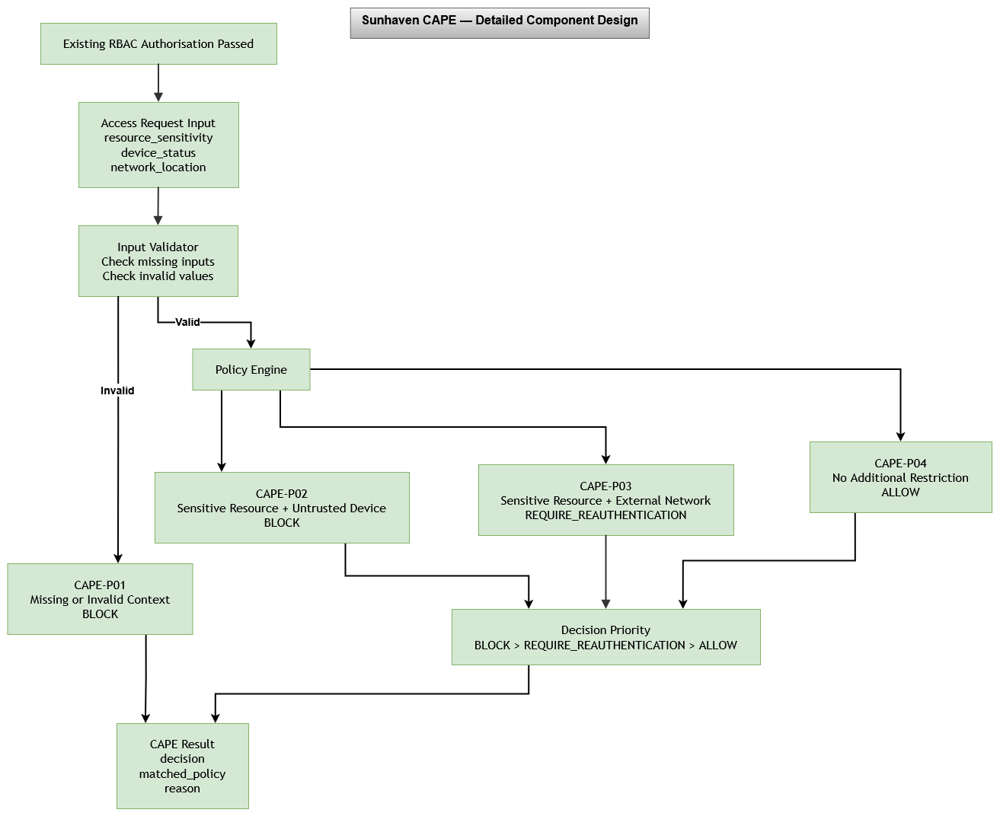

# CAPE Detailed Component Design

## 1. Purpose

This design shows how the Context-Aware Access Policy Engine (CAPE) processes an access request and returns a contextual security decision.

CAPE works as an additional security check after normal Role-Based Access Control (RBAC) authorisation has passed.

## 2. Detailed Component Diagram

The editable version of the diagram is also available in:

`diagrams/cape/cape-detailed-component-design.drawio`

## 3. Processing Flow

CAPE follows these steps:

1. Receives `resource_sensitivity`, `device_status` and `network_location`.
2. Checks that the required inputs are present and valid.
3. If an input is missing or invalid, CAPE-P01 returns `BLOCK`.
4. If the inputs are valid, the Policy Engine checks CAPE-P02, CAPE-P03 and CAPE-P04.
5. If more than one policy applies, CAPE uses the decision priority:

   `BLOCK > REQUIRE_REAUTHENTICATION > ALLOW`

6. CAPE returns:
   - `decision`
   - `matched_policy`
   - `reason`

## 4. Policy Decisions

The component uses four security policies:

- **CAPE-P01:** Missing or invalid required context → `BLOCK`
- **CAPE-P02:** Sensitive resource from an untrusted device → `BLOCK`
- **CAPE-P03:** Sensitive resource from an external network → `REQUIRE_REAUTHENTICATION`
- **CAPE-P04:** No additional contextual restriction → `ALLOW`

The full policy definitions are available in:

`policies/cape/security-policies.md`

## 5. Implementation

The design will be implemented using simple Python code.

The implementation will use basic functions and conditions for input validation and policy checking.

CAPE will not replace RBAC, perform MFA, check Microsoft Intune directly or detect the real location of a user.

The completed implementation will be tested using controlled access-request scenarios.

## Evaluation and Limitations

CAPE successfully checks the given context and returns ALLOW, BLOCK or REQUIRE_REAUTHENTICATION. The automated tests confirmed that all four CAPE policies and the decision priority work correctly.

CAPE uses supplied values for resource sensitivity, device status and network location. It does not collect real device or location information.

CAPE works as an extra security check after RBAC. It does not perform MFA or re-authentication itself.

This is a working prototype and is not directly connected to Microsoft Entra Conditional Access.

